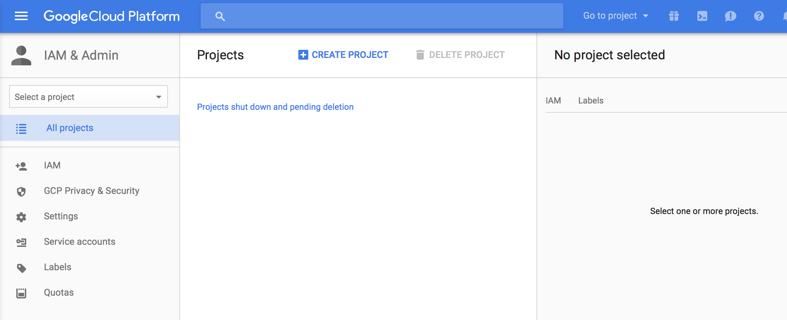
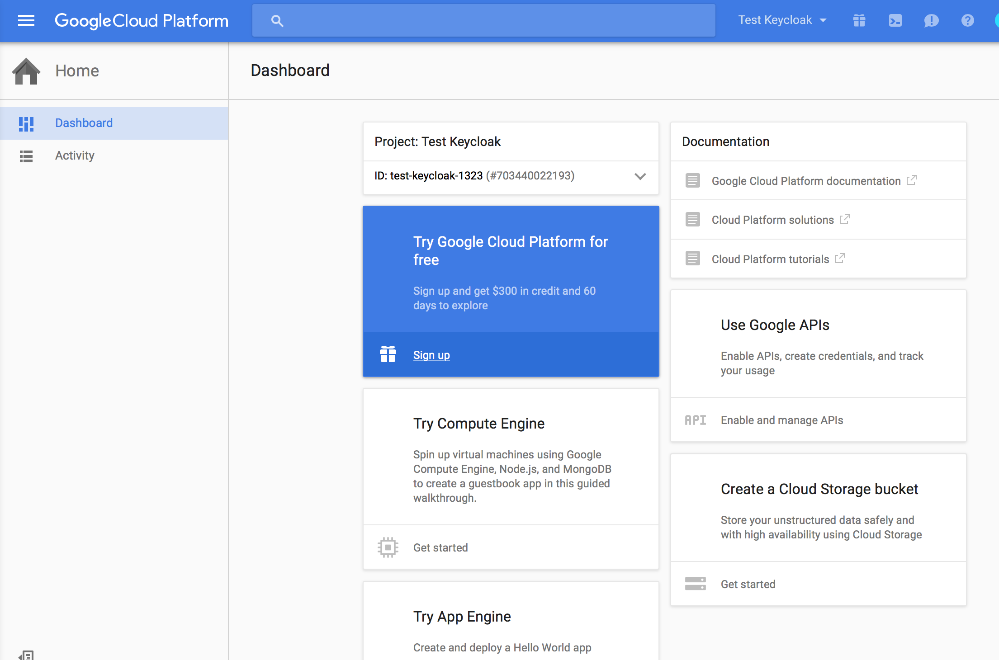
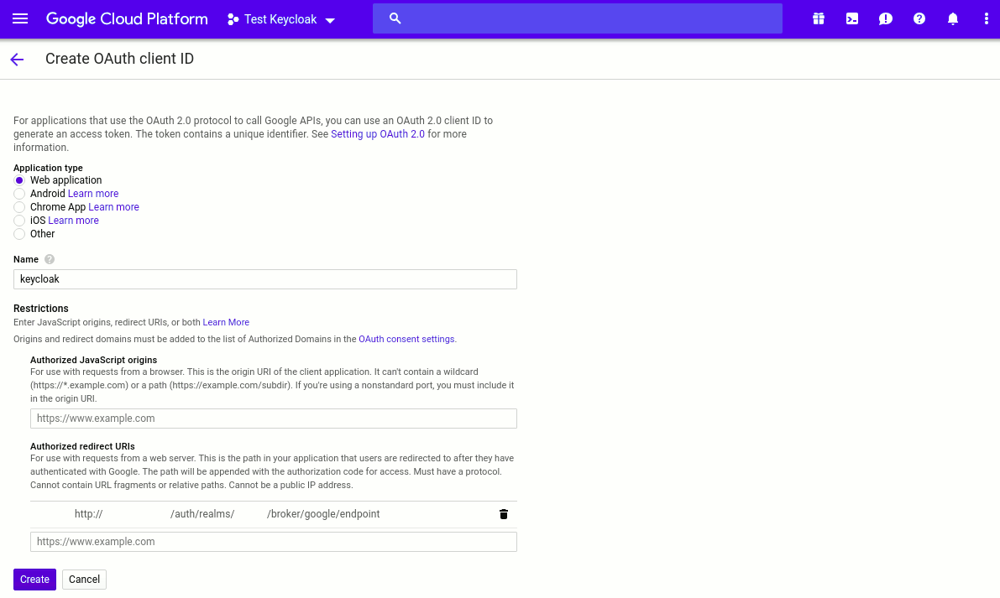
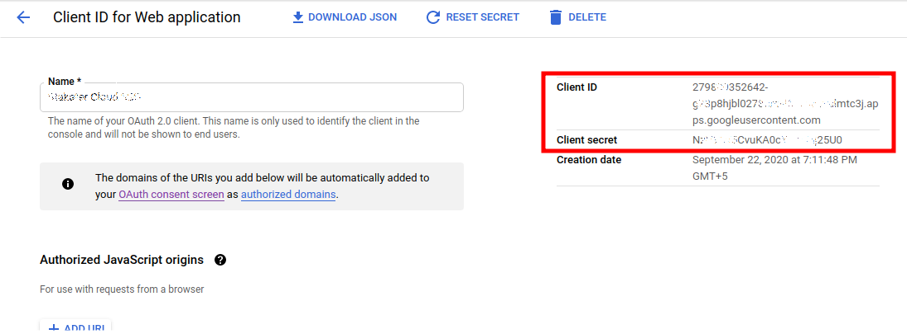

# Configuring a Google identity provider

To enable login with Google you first have to create a project and a client in the [Google Developer Console](https://console.cloud.google.com/project).

1. Log in to the Google [Developer Console](https://console.cloud.google.com/project)

    

1. Click the `Create Project` button. Use any value for `Project name` and `Project ID` you want, then click the `Create` button. Wait for the project to be created (this may take a while). Once created you will be brought to the project's dashboard.

    

1. Google requires some basic information about the product before creating any secrets for it. For a new project, you have first to configure `OAuth consent screen`. Fill in `OAuth consent screen` details. Keep the **Application Type** `Internal`. Add the `email`, `profile` and `openid` in the allowed **Scopes**. Under **Authorized domains** add `kubeapp.cloud` along with any hosted domain(s) which you want to allow. e.g if Authorized domain is `xyz.com` then `bob@xyz.com` will be allowed

1. Then navigate to the `APIs & Services` section in the Google Developer Console. On that screen, navigate to `Credentials` administration. select `OAuth client ID` under the `Create credentials` button.

1. You will then be brought to the `Create OAuth client ID` page. Select `Web application` as the application type. Specify the name you want for your client. In `Redirect URI` (**This will be provided by Stakater Support**) click the Create button.

    

1. After you click Create you will be brought to the `Credentials` page. Click on your new OAuth 2.0 Client ID to view the settings of your new Google Client. You will need to obtain the `client ID` and `secret` **Send these to Stakater Support**.

    

## Items provided by Stakater Support

* `Redirect URIs`

## Items to be provided to Stakater Support

* `Client ID`
* `Secret`
* `Authorized Domain` Users of this Google domain will be able to access the cluster
