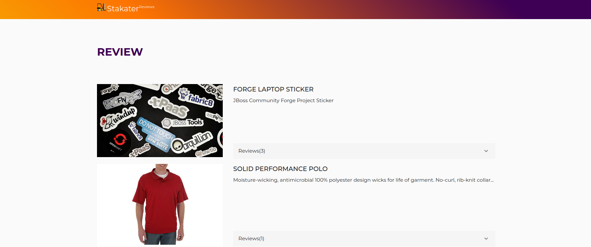

# Add new application

This guide covers the step-by-step guide to onboard a new project/application/microservice on SAAP.

Changes required in application repository:

1. Add Dockerfile to application repository and push it to nexus
1. Add Helm Chart to application repository and push it to nexus
1. Push Docker Image to Nexus Docker.
1. Push Helm Chart to Nexus Helm

Changes required in `gitops config repository`:

1. Add dev environment in `apps-gitops-config` repository for application
1. Add application to the dev environment and sync ArgoCD Application
1. View Application in Cluster

Replace angle brackets with following values in below templates:

- `<tenant>`: Name of the tenant
- `<application>`: Name of the application
- `<env>`:  Environment name
- `<gitops-repo>`:  URL of your GitOps repo
- `<nexus-repo>`: URL of nexus repository

## 1. Add **Dockerfile** to application repository

We need a **Dockerfile** for our application present inside our code repo.  Navigate to [`RedHat image registry`](https://catalog.redhat.com/software/containers/search) and find a suitable image for the application.

Below is a Dockerfile for a ReactJS application for product reviews. Visit for more info: <https://github.com/stakater-lab/stakater-nordmart-review-ui>

```Dockerfile
FROM node:14 as builder
LABEL name="Nordmart review"

# set workdir
RUN mkdir -p $HOME/application
WORKDIR $HOME/application

# copy the entire application
COPY . .

# install dependencies
RUN npm ci
ARG VERSION

# build the application
RUN npm run build -- --env VERSION=$VERSION

EXPOSE 4200

CMD ["node", "server.js"]
```

> Create [multi-stage builds](https://docs.docker.com/build/building/multi-stage/), use multiple `FROM` statements. Each `FROM` instruction can use a different base, and each of them begins a new stage of the build. You can selectively copy artifacts from one stage to another, leaving behind everything you don’t want in the final image. The end result is the same tiny production image as before, with a significant reduction in complexity. You don’t need to create any intermediate images, and you don’t need to extract any artifacts to your local system at all.

Look into the following dockerizing guides for a start.
| Framework/Language | Reference                                                   |
|--------------------|-------------------------------------------------------------|
| NodeJS             | <https://nodejs.org/en/docs/guides/nodejs-docker-webapp/>     |
| Django             | <https://blog.logrocket.com/dockerizing-django-app/>          |
| General            | <https://www.redhat.com/sysadmin/containerizing-applications> |

## 2. Add Helm Chart to application repository

In application repo add Helm Chart in ***deploy*** folder at the root of your repository. To configure Helm chart add following 2 files in ***deploy*** folder.

1. A Chart.yaml is YAML file containing information about the chart. We will be using an external helm dependency chart called [Stakater Application Chart](https://github.com/stakater/application). The Helm chart is present in a remote Helm Chart repository

    > More Info : Stakater Application Chart <https://github.com/stakater/application>

    ```yaml
    apiVersion: v2
    name: <application>
    description: A Helm chart for Kubernetes
    dependencies:
    - name: application
      version: 1.2.10
      repository: https://stakater.github.io/stakater-charts
    type: application
    version: 1.0.0
    ```

2. The values.yaml contains all the application specific **kubenetes resources** (deployments, configmaps, namespaces, secrets, services, route, podautoscalers, RBAC) for the particular environment. Configure Helm values as per application needs.

    Here is a minimal values file defined for an application with deployment,route,service.

    ```yaml
    # Name of the dependency chart
    application:
      # application name should be short so limit of 63 characters in route can be fulfilled.
      # Default route name formed is <application-name>-<namespace>.<base-domain> .
      # Config Maps have <application> prefixed
      applicationName: <application>

      deployment:
        imagePullSecrets: nexus-docker-config-forked
        additionalLabels:
          mylabel: mylabelvalue
        envFrom:
          <application>-dbconfig:
            type: configmap
            nameSuffix: dbconfig
      configMap:
        enabled: true
        files:
          dbconfig:
            DB_NAME: "my-application-db"
            MONGO_HOST: "my-db-host"
      route:
        enabled: true
        port:
          targetPort: http
    ```

3. Make sure to validate the helm chart before doing a commit to the repository.
If your application contains dependency charts run the following command in deploy/ folder to download helm dependencies using **helm dependency build**.

    ```sh
    # Download helm dependencies in Chart.yaml
    helm dependency build
    ```

    

4. Run the following command to see the Kubernetes manifests are being generated successfully and validate whether they match your required configuration.

    ```sh
    # Generates the chart against values file provided
    # and write the output to application-output.yaml
    helm template . > application-output.yaml
    ```

    Open the file to view raw Kubernetes manifests separated by '---' that ll be deployed for your application.

References to Explore:

- [`stakater-nordmart-review`](https://github.com/stakater-lab/stakater-nordmart-review/deploy)
- [`stakater-nordmart-review-ui`](https://github.com/stakater-lab/stakater-nordmart-review-ui/deploy)
- [All configurations available via Application Chart Values](https://github.com/stakater/application/blob/master/application/values.yaml)

## 3. Push Docker Image to Nexus

Navigate to the cluster Forecastle and get the Nexus URL. Get and copy the nexus url.


Replace the placeholders and Run the following command inside application folder.

```sh
# Buldah Bud Info : https://manpages.ubuntu.com/manpages/impish/man1/buildah-bud.1.html
buildah bud --format=docker --tls-verify=false --no-cache -f ./Dockerfile -t <nexus-repo-url>/<app-name>:1.0.0 .
```

Lets push the image to nexus docker repo. Make sure to get credentials from Stakater Admin.

```sh
# Buildah push Info https://manpages.ubuntu.com/manpages/impish/man1/buildah-push.1.html
buildah push --tls-verify=false --digestfile ./image-digest <nexus-repo-url>/stakater-nordmart-review:snapshot-pr-350-68b5d049 docker://<nexus-repo-url>/
```

## 4. Push Helm Chart to Nexus

After successfully pushing the image to Nexus. We need to package our helm chart and push to Nexus Helm Repo.
Run the following command to package the helm chart into compressed file.

```sh
# helm package [CHART_PATH]
helm package .
# output : successfully packaged chart and saved it to: /Desktop/Tasks/stakater/stakater-nordmart-review-ui/deploy/stakater-nordmart-review-ui-1.0.0.tgz
```

Now lets upload the chart to Nexus Helm Repo using curl.

```sh
# heml
curl -u "<helm_user>":"<helm_password>" <nexus-repo-url>/repository/helm-charts --upload-file "stakater-nordmart-review-ui-1.0.0.tgz"
```

## 5. Add application chart to `apps-gitops-config`

Navigate to `apps-gitops-config` repository and add a helm chart in path `<tenant-name>/<app-name>/dev`.


```yaml
# <tenant-name>/<app-name>/dev/Chart.yaml
apiVersion: v2
name: <application-name>
description: A Helm chart for Kubernetes
dependencies:
  - name: <chart-name-in-deploy-folder>
    version: "1.0.0"
    repository: <nexus-repo>/repository/helm-charts/
version: 1.0.0
-----------------------------------------
# <tenant-name>/<app-name>/dev/values.yaml
<dependency-name>:
  application:
    deployment:
      image:
        repository: <nexus-repo>/<chart-name-in-deploy-folder>
        tag: 1.0.0
```

## 6. View Application in Cluster

Login into ArgoCD UI using Forecastle console. Visit the application against dev environment inside your tenant. Usual naming convention is **tenantName-envName-appName**. Make sure that there aren't any error while deploying during ArgoCD.


Visit the OpenShift console to verify the application deployment.


Visit the application url using routes to check if application is working as expected.



