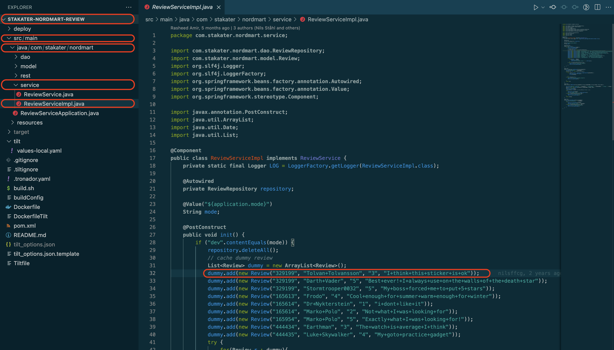

# Deploy your Application

There are multiple ways to deploy your Application on the Cluster.

- For development with tilt, use tilt for deploying the application on test clusters
    > This the recommended local development workflow

- For Deployment via GitOps, follow guide for Deploying the Application with GitOps
    > This is the recommended production workflow

## Objective

Learn local development for testing and developing applications on local/lab clusters.

## Key Results

- Create a Tiltfile for your application.

- Deploy the application with tilt.

## Tutorial

In this guide we will deploy an application with tilt and namespace in remote OpenShift cluster

1. Clone this sample repo [Nordmart-review](https://github.com/stakater-lab/stakater-nordmart-review)

1. You should have a namespace in remote/local cluster; If you are in SAAP then enable sandbox namespace/project/environment for your tenant; you can read more [here](https://docs.stakater.com/mto/main/customresources.html)

1. Login to cluster as discussed in the previous tutorial.

1. Switch project to sandbox namespace/project/environment

    ```bash
    oc project <MY-SANDBOX>
    ```

1. Login to OpenShift internal docker registry

    First get the OpenShift internal docker registry URL and set in HOST variable name

    ```bash
    HOST=image-registry-openshift-image-registry.apps.[CLUSTER-NAME].[CLUSTER-ID].kubeapp.cloud
    ```

    NOTE: Ask `sca` (SAAP Cluster Admin) or `cluster-admin` to provide you the OpenShift internal registry route

    Then login into docker registry with following command:

    ```bash
    docker login -u $(oc whoami) -p $(oc whoami -t) $HOST
    ```

    If you get this error `x509: certificate signed by unknown authority` then you need to update your `/etc/docker/daemon.json` file and add the insecure registry

    ```bash
    {
        "insecure-registries" : [ "HOST" ]
    }
    ```

1. (Optional) Add Helm chart repos

    If you reference Helm charts from private registry then you first need to add it

    ```bash
    cd deploy

    # Helm credentials can be found in Vault or in a secret in build namespace
    helm repo add stakater-nexus <private repo URL> --username helm-user-name --password ********; 

    cd ..
    ```

1. Update Helm dependencies

    ```bash
    cd deploy

    helm dependency update

    cd ..
    ```

1. Go through the [Tiltfile](https://github.com/stakater-lab/stakater-nordmart-review/blob/main/Tiltfile) of the application

1. Check the `local_resource` section in the Tiltfile

1. Create `tilt_options.json` file

    Remove `.template` from the file named `tilt_options.json.template`

    

    And then fill up all three things

      1. `namespace`: your sandbox environment name
      1. `default_registry`: the OpenShift internal registry route (you have set in step # 6 in HOST above) and then add your namespace name after `/`
      1. `allow_k8s_contexts`: given you are logged in the cluster; then run `oc config current-context` to get the value for `allow_k8s_contexts`

          e.g.

          ```json
          {
              "namespace": "tilt-username-sandbox",
              "default_registry": "image-registry-openshift-image-registry.apps.[CLUSTER-NAME].[CLUSTER-ID].kubeapp.cloud/tilt-username-sandbox",
              "allow_k8s_contexts": "tilt-username-sandbox/api-[CLUSTER-NAME]-[CLUSTER-ID]-kubeapp-cloud:6443/user@email.com"
          }
          ```

1. Go through the `.gitigore` and check tilt and Helm specific ignores

    ```sh
    # Tilt
    tilt_options.json
    tilt_modules/

    # Helm
    /deploy/charts
    ```

1. Go through `.tiltignore`

    ```sh
    **/charts
    **/tmpcharts
    ```

1. Go through `values-local.yaml` in a `tilt` folder in base application directory.

    `values-local.yaml` should contain the following content. Make sure that replica count should always be 1.

    ```yaml
    application:
        
      deployment:
        imagePullSecrets: null

        # Tilt live update only supports one replica
        replicas: 1

        image:
          tag: null
    ```

1. Validate this application is not running already

    

1. Run `tilt up` at base directory

    

    Open the tilt browser; just hit the space

    

    If everything is green then the application will be deployed in the cluster

    

    Press space key to view the progress in Tilt web UI. The application should be running in the namespace used in `tilt_options.json` file.

1. Lets browse through some reviews; go to routes

    

    Click on the review route

    

    In the end of the route add `/api/review/329199`

    Review the json output

    

1. Lets make one change; we will update the first review text to "Tilt Demo"

    

    Switch back to tilt browser and you will see it has started picking up changes

    

    Within few seconds the change will be deployed; and you can refresh the route to see the change

    

    Awesome! you made it

1. Run `tilt down` to delete the application and related configuration from the namespace
