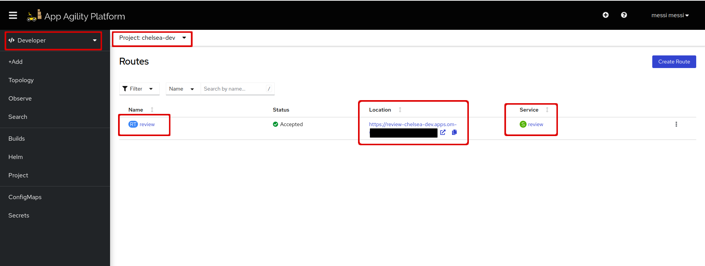
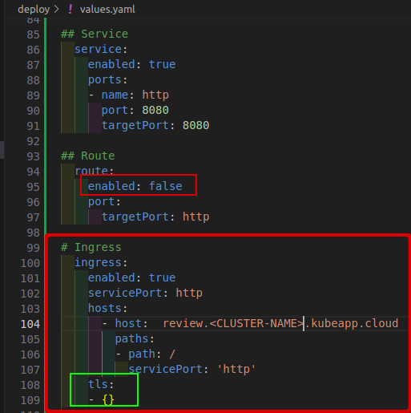

# Expose your Application

After successfully deploying your application on Red Hat OpenShift, you need to expose it to internal or external traffic so that users and other resources can access your application over the network. This tutorial will guide you through the process of exposing your application and making it accessible from outside the OpenShift cluster.

## Objective

- Expose your application internally using service
- Expose your application externally using route or ingress

## Key Results

- Application is exposed for traffic in/out of cluster

## Tutorial

### Expose Application Within the Cluster

Create a service:

1. In your `deploy/values.yaml` file, define a service:

    ```yaml
    ## Service
      service:
        enabled: true
        ports:
        - name: http
          port: 8080
          targetPort: 8080
    ```

    It should look like this:

    

    a) Service is `enabled: true`, which means the service resource will be created on the OpenShift cluster when you tilt up your application.

    b) `port:` This section defines the port configuration for the service resource.

    c) `name: http`: We have seen in the route `targetPort: http` was given which was pointing to this service port named `http`. `port: 8080` is the port of the service itself. `targetPort: 8080` is the pod/container port of the application.

      > You can change or add any configuration for the service. To see more configurations [click](https://github.com/stakater/application.git).

1. Run `tilt up` at the root of your directory.

1. Let's go to the services under the networking section in your namespace

      

  Here we can see that the service named by review is created. Take a look at the pod selector and location, the service has exposed our review pod on port `8080`.

## Expose your application to external traffic via route

OpenShift provides a routing mechanism called "routes" that allows you to expose applications using hostnames and paths. Routes are created using the Route resource and can provide additional features such as SSL termination and path-based routing. To create a route:

1. In your `deploy/values.yaml` file, define a route:

    ```yaml
    ## Route
    route:
      enabled: true
      port:
        targetPort: http
    ```

    It should look like this:

    

    a) Route is `enabled: true`, which means the route resource will be created when you tilt up.

    b) `port:` This section defines the port configuration for the Route resource.

    c) `targetPort: http`: This specifies the target port for the Route. In this case, the value is set to `http`, which is a named port defined in the associated Service configuration. It represents the port on which the backend service is listening to handle incoming traffic.

    > You can change or add any configuration for the route. To see more configurations [click](https://github.com/stakater/application.git).

1. Run `tilt up` at the root of your directory.

1. Let's go to the routes resource in your namespace

    

1. Click on the "review" route

    

  Here you can see the route and the service that is associated with it.

1. At the end of the route add `/api/review/329199`

    Now you can access the application externally with this route.

    

## Expose your application to external traffic via ingress

1. To expose application via `Ingress`, we need a service. Create a service from the section [Expose Application Within the Cluster](#expose-application-within-the-cluster).

1. In your `deploy/values.yaml` file, define ingress:

    ```yaml
    # Ingress
    ingress:
      enabled: true
      pathType: ImplementationSpecific
      hosts:
        - host:  review.[CLUSTER-NAME].kubeapp.cloud
          paths:
          - path: /
            servicePort: 'http'
    ```

    It should look like this:

    

    a) First make sure the **route** field is `enabled: false`. It's because Ingress will create it's own route.

    b) Ingress is `enabled: true`, it means the ingress resource will be created on our cluster when we tilt up.

    c) `pathType: ImplementationSpecific`: Sets the type of path matching for the Ingress resource. The value `ImplementationSpecific` indicates that the specific implementation should determine the path matching behavior.

    d) `hosts`: Defines a list of hosts for the Ingress resource. In this case, there is a single host specified.

      - `host: review.[CLUSTER-NAME].kubeapp.cloud`: Specifies the host for the Ingress resource. You can replace [CLUSTER-NAME] with the actual name of your cluster. This means that the Ingress resource will handle requests for the host review.[CLUSTER-NAME].kubeapp.cloud.

        > Note: In order to use a different host, you must have a DNS record pointing to the OpenShift cluster's external IP or load balancer.

      - `paths`: Specifies a list of paths for the given host.

      - `path: /`: Defines the path for incoming requests. In this case, requests that match the root path ("/") will be routed to the corresponding backend service.

      - `servicePort: 'http'`: Specifies the port or target port of the backend service that should handle the incoming requests. The value 'http' represents the name of the port defined in the Service resource associated with the backend service.

    > You can change or add any configuration for the ingress. To see more configurations [click](https://github.com/stakater/application.git).

1. Run `tilt up` at the root of your directory.

1. Let's go to the cluster and see your ingress resource and the route associated with it in your namespace:

    

    We can see there is an `Ingress` resource created with our mentioned `Host`.

1. Now let's see if `Ingress` has created the route. Go to the routes under networking section:

    

   Here you can see the route is created and the service that is associated with `Ingress`.

1. Copy the route with the copy icon and add `/api/review/329199` at the end of the route.

    Now you can access the application externally via ingress.

    

By following the steps outlined above, you can successfully expose your application deployed on Red Hat OpenShift, using the example application "`stakater-nordmart-review-api`". Using the NodePort, LoadBalancer, or Route approach, you can make your application accessible from outside the OpenShift cluster, allowing users to access and interact with your application over the network.

## Whitelisting application routes

See [Additional route configurations](../../../../for-administrators/secure-your-cluster/secure-routes.md#additional-route-configuration) section on how to allow only whitelisted IPs for your application routes
