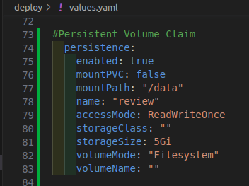
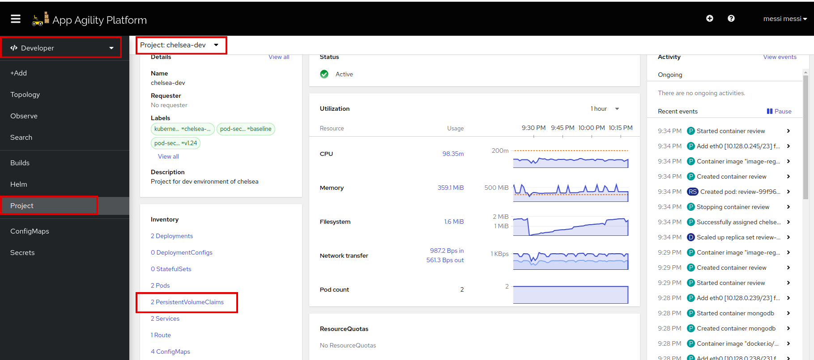
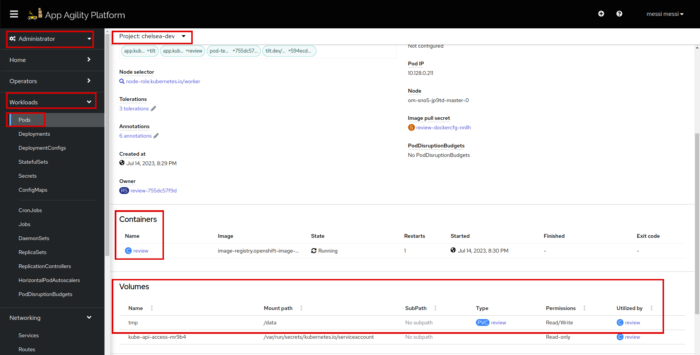

# Persist your Application

In stateful applications deployed on the SAAP (Stakater App Agility Platform), ensuring data persistence is crucial. To achieve this, SAAP provides Persistent Volumes `(PVs)` and Persistent Volume Claims `(PVCs)` as powerful abstractions for managing and allocating storage resources. This tutorial to help you understand and implement data persistence in your SAAP applications using `PVs` and `PVCs` effectively.

## Objective

- Configure PVs and PVCs in SAAP applications for efficient storage allocation.
- Integrate PVs and PVCs with your SAAP application for data persistence.

## Key Results

- Ensure data durability in stateful applications deployed on SAAP.

## Tutorial

1. To create `PVs` and `PVCs` for your application, we need to add **persistence** in our `deploy/values.yaml`.

    Persistence field is to provide a convenient and customizable way to define the PVC settings within the Helm chart configuration by specifying the PVC settings in the values.yaml file.

    ```yaml
      ## Persistence
      persistence:
        enabled: true  # Enables persistence for the application.
        mountPVC: false  # Indicates that the PVC will not be automatically mounted to a pod.
        mountPath: "/data"  # Specifies the mount path where the PVC will be mounted within the pod.
        name: "review"  # Provides a unique name for the PVC resource.
        accessMode: ReadWriteOnce  # Specifies the access mode for the PVC (read-write by a single node).
        storageClass: ""  # Specifies the desired storage class for the PVC. (Here, using the default storage class.)
        storageSize: 5Gi  # Specifies the desired storage capacity for  the PVC (Here, 5 Gigabytes).
        volumeMode: "Filesystem"  # Specifies the volume mode as "Filesystem". (You can choose other volumeModes according to your application requirements)
        volumeName: ""  # Specifies the name of the Persistent Volume (PV) to be used by the PVC. This field is usually left empty, as PVs are dynamically provisioned and associated with PVCs by the cluster.
    ```

    > Note: Make sure that the indentation is correct. It follows `application.persistence`.

    It should look like this:

    

1. Once the Persistence is defined in your `deploy/values.yaml`, you can proceed with mounting them in your pod. Mounting the PV and PVC allows your application to access and utilize the persistent storage provided by the PV.

    ```yaml
      ## volume
      # Define the Persistent Volume (PV) binding for the application.
      volumes:
        tmp:  # Volume name
          persistentVolumeClaim:
            claimName: review  # Specify the claimName to bind the Persistent Volume Claim (PVC) with the name "review" to this volume tmp.

      # Define the mount path within the pod for the PV.
      volumeMounts:
        tmp:  # Volume name
          mountPath: /data  # Specify the mountPath as "/data" to mount the Persistent Volume (PV) referenced by the volume named "tmp" to this path within the pod.
    ```

    > Note: Make sure that the indentation is correct. It follows `application.deployment.volumes` and `application.deployment.volumeMounts`.

    It should look like this:

    

1. Run `tilt up` at the root of your directory. Hit the space bar and the browser with `TILT` logs will be shown. If everything is green then the changes will be deployed on the cluster.

1. login to SAAP, there should be a Persistent Volume Claim created when you get an overview of your project/namespace.

    

1. Click on Persistent Volume Claim

    

    > Note: The PVC named "review" has dynamically provisioned a PV and gave a default storage class named "standard". The most important thing here is the status of PVC which is "Bound" which means not only all the configurations were right but have efficiently applied on the cluster and the application.

1. Let's see the application pod "review". Click on the review pod:

    

1. Scroll down to see if the pod volume for this application is mounted with the name `tmp` and the PVC "review".

    

> Note: You can change or add any configuration for the PVC or volumes. To see more configurations [click](https://github.com/stakater/application.git).
