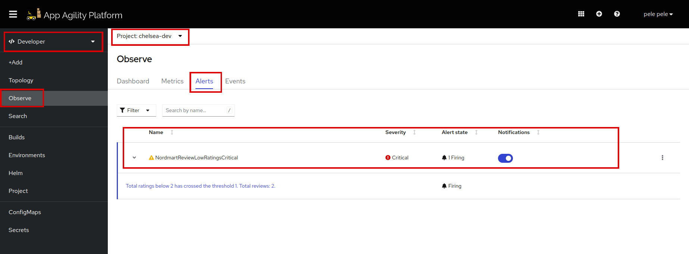
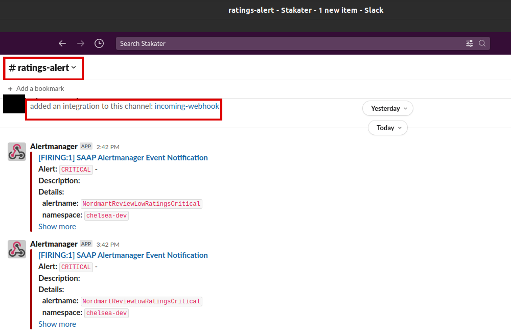

# Enable Alerts for your Application

In the modern landscape of software development, monitoring and managing the health and performance of your applications is crucial. To ensure seamless operations and timely responses to issues, setting up alerts and notifications is essential. In this tutorial, we will guide you through the process of enabling alerts and notifications for your application using Prometheus and Alertmanager within your SAAP (Stakater App Agility Platform) cluster.

## Objectives

- Establish PrometheusRule Custom Resources to define conditions for triggering alerts based on specific metrics.
- Configure the Alertmanager to handle alerts and send notifications to the appropriate channels, such as Slack.
- Establish a Secret to securely store and manage the webhook URL for sending alerts to Slack.

## Key Results

- Confirm that alerts are firing correctly by observing the alerts in the SAAP and notifying Slack.

Now that we have enabled Service Monitor for our application in the previous section, let's create alerts for it. Metrics endpoints are scraped via ServiceMonitor by Prometheus and Prometheus is already installed on your SAAP cluster.

## Tutorial

### Defining PrometheusRule

If you want to generate an alert based on some metric, you will need a PrometheusRule Custom Resource. A PrometheusRule defines when an alert should fire.

Now let's add a PrometheusRule for the application. In the previous section, we added a custom metric that records the review. We are going to use the custom metric to write a `Prometheus` rule that fires when we get too many low ratings.

1. You need to add the following lines to your `deploy/values.yaml` file:

    ```yaml
      prometheusRule:
        enabled: true
        additionalLabels:
          prometheus: stakater-workload-monitoring
        groups:
          - name: nordmart-review-low-rating-warning
            rules:
              - alert: NordmartReviewLowRatingsCritical
                annotations:
                  message: >-
                    Total ratings below 2 has crossed the threshold 1. Total reviews: {{ $value }}.
                expr: >
                  sum by (namespace) (nordmart_review_ratings_total{rating="2"} or nordmart_review_ratings_total{rating="1"}) > 1
                labels:
                  severity: critical
    ```

    !!! note
        The indentation follows by **application.prometheusRule**.

### Alert Manager

Now we need to tell Alert Manager where to send the alert. For this, we will need to add an AlertManagerConfig.

1. If you need to send an alert to a Slack channel. You will first need to [add a webhook for that channel in Slack](https://docs.stakater.com/saap/managed-addons/monitoring-stack/log-alerts.html)
Once you have the webhook Url, you can add the AlertManagerConfig. The Alertmanager uses a secret to pick up details of the endpoint to send the alerts to.

1. Let's create the secret first. Log in to SAAP > Administrator > Workloads > Secrets in your namespace. Create a secret from YAML. Replace "namespace" with the namespace in which your application is deployed and "api_url" with base64 encoded webhook URL:

    ```yaml
    kind: Secret
    apiVersion: v1
    metadata:
      name: review-slack-webhook
      namespace: <namespace>
    data:
      api_url: >-
        <api_url>
    type: Opaque
    ```

1. Let's add the AlertManagerConfig, add this YAML to `deploy/values.yaml`, and remember to replace "channel-name" with your channel name.

    ```yaml
      alertmanagerConfig:
        enabled: true
        selectionLabels:
          alertmanagerConfig: workload
        spec:
          receivers:
            - name: nordmart-review-receiver
              slackConfigs:
                - apiURL:
                    key: api_url
                    name: review-slack-webhook
                  channel: '<#channel-name>'
                  sendResolved: true
                  text: |2-
                    {{ range .Alerts }}
                    *Alert:* `{{ .Labels.severity | toUpper }}` - {{ .Annotations.summary }}
                    *Description:* {{ .Annotations.description }}
                    *Details:* {{ range $k, $v := .Labels }} - *{{ $k }}:* {{ $v }}
                    {{ end }}
                   {{ end }}
                  title: '[{{ .Status | toUpper }}{{ if eq .Status "firing" }}:{{ .Alerts.Firing | len }}{{ end }}] SAAP Alertmanager Event Notification'
                  httpConfig:
                    tlsConfig:
                      insecureSkipVerify: true
          route:
            groupBy:
              - alertname
              - severity
            groupInterval: 3m
            groupWait: 30s
            repeatInterval: 1h
            matchers:
              - name: alertname
                value: NordmartReviewLowRatingsCritical
            receiver: nordmart-review-receiver
    ```

  !!! note
      The indentation follows by **application.alertmanagerConfig**.

1. Save and run `tilt up` at the root of your directory. Hit the space bar and the browser with `TILT` logs will be shown. If everything is green then the changes will be deployed on the cluster.

    Now that we have created everything we need, let's see the alerts firing. Log in to SAAP, and change the view to "Developer". You will see the 'Observe' tab in the left panel.

    

    Let's see if you got the notification on your channel:

    

Isn't it Awesome!!! Let's move to the next chapter.
