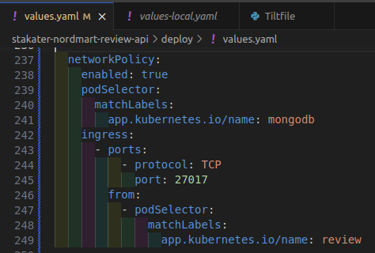
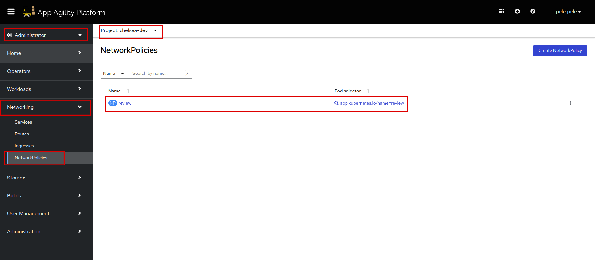
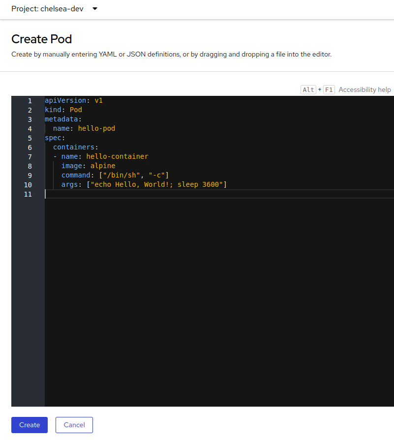
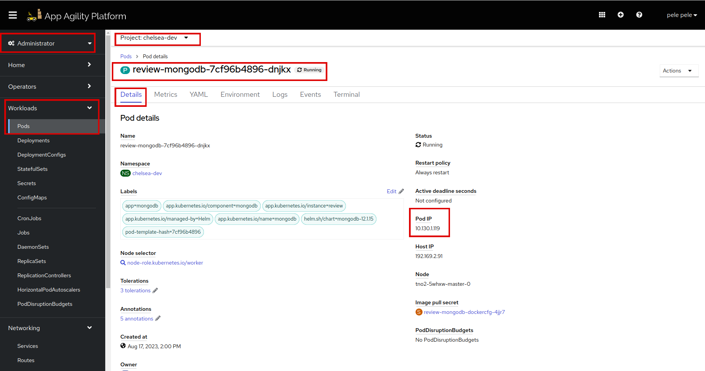
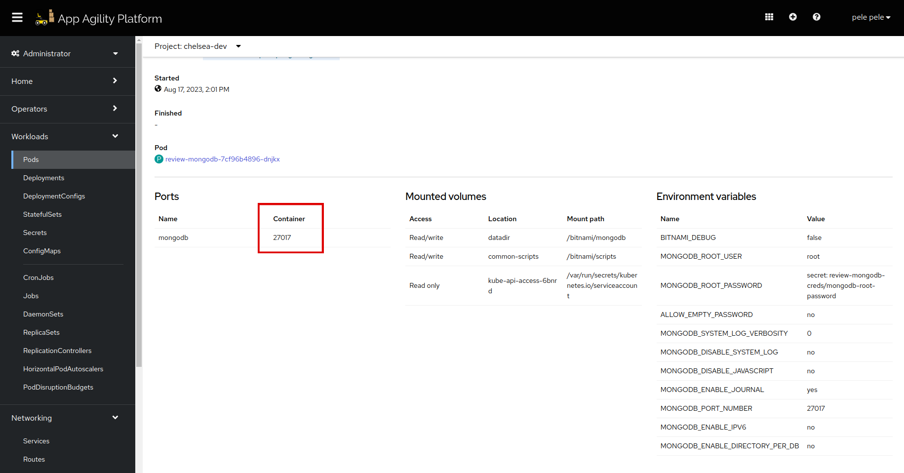
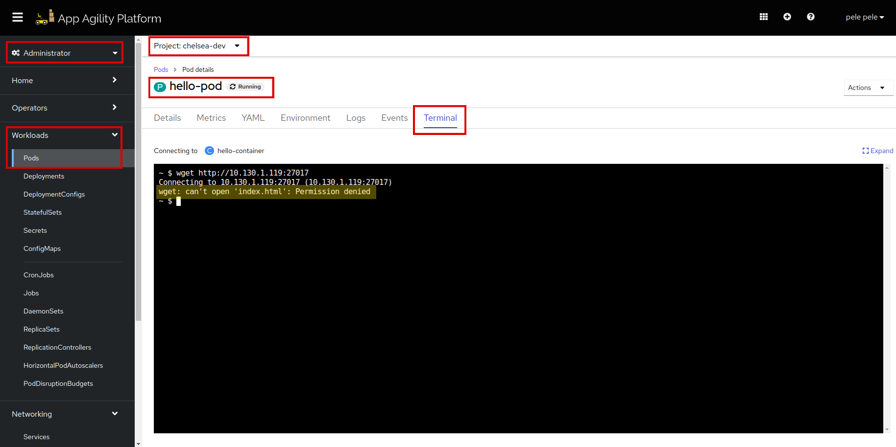

# Add Network Policy to your Application

A `Network Policy` allows you to specify how groups of pods are allowed to communicate with each other and with other network endpoints. It acts as a firewall for your pods, controlling both incoming and outgoing traffic based on defined rules. Network policies are used to enhance the security and isolation of your applications.

In SAAP we are using `Network Policies` to control communication between pods within our cluster. This helps ensure that your application pods can communicate only with specific pods (e.g., MongoDB) and restricts communication from other pods that should not have access. By configuring `ingress` and `egress` rules, you are specifying the allowed traffic paths, thus enhancing the security and control of your application's network communication.

## Objectives

- Configure Network Policies to control pod communication.
- Verify the effectiveness of Network Policies through testing with a different pod.

## Key Results

- Successfully create and test a Network Policy and applied it to restrict pod communication.

## Tutorial

Let's set a `Network Policy` on the `review-mongodb` pod so that no other pods can communicate with our database other than the application pod `review`.

1. Add `Network Policy` yaml to your `deploy/values.yaml`.

    ```yaml
    # Define a NetworkPolicy configuration.
    networkPolicy:
      enabled: true  # Enable the NetworkPolicy.
      podSelector:  # Specify the pods to which the NetworkPolicy rules will apply.
        matchLabels:  # Define labels to match pods.
          app.kubernetes.io/name: mongodb  # Match pods with the label 'app.kubernetes.io/name' equal to 'mongodb'.
      ingress:  # Define ingress rules for incoming traffic.
        - ports:  # Specify a list of ports and their protocols.
            - protocol: TCP  # Allow TCP traffic on port 27017.
              port: 27017
          from:  # Define the source of allowed incoming traffic.
            - podSelector:  # Allow traffic from pods matching certain labels.
                matchLabels:  # Match pods with the label 'app.kubernetes.io/name' equal to 'review'.
                  app.kubernetes.io/name: review
    ```

    It should look like this:

    

    So, our application pod `review` will not entertain any traffic from any other pod.

    > Note: The indentation should be **application.networkPolicy**.

1. Save and run `tilt up` at the root of your directory. Hit the space bar and the browser with `TILT` logs will be shown. If everything is green then the changes will be deployed on the cluster.

1. Log in to SAAP and see if the `Network Policy` is created in your namespace.

    

1. Open the `review` Network Policy, scroll down and see the rules:

    

    We can see the rule is set properly.

To check if our `Network Policy` is working properly, let's create a random pod and try to communicate the `review-mongodb` pod through it.

1. Create a pod in your namespace on SAAP. Copy below yaml:

    ```yaml
    apiVersion: v1
    kind: Pod
    metadata:
      name: hello-pod
    spec:
    containers:
     - name: hello-container
       image: alpine
       command: ["/bin/sh", "-c"]
       args: ["echo Hello, World!; sleep 3600"]
    ```

1. Click on `Create Pod` on the top right corner. Paste the yaml and hit `save`.

    

    A new pod should be created.

1. Go to the `review-mongodb` pod and copy the `Pod IP`.

    

    Let's find the port for the `review-mongodb` pod. Once you copy the IP, scroll down to find the container. Click the `review` container.

    

    Scroll down and copy the port:

    

1. Let's go to `hello-pod` and then to it's `Terminal`. Paste this command, and make sure to replace the `review-mongodb` pod IP with yours.

    ```sh
    wget http://<review-mongodb-pod-ip>:27017
    ```

    

    We can see that `hello-pod` can't access `review-mongodb`.

Network Policies offer a robust mechanism to control and secure communication between pods in SAAP. By grasping the concepts and techniques covered in this tutorial, you're better equipped to implement effective network segmentation and enhance the overall security posture of your applications.

Cheers! Let's move to the next tutorial.
