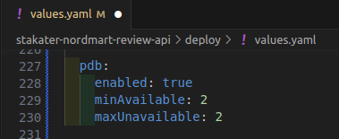
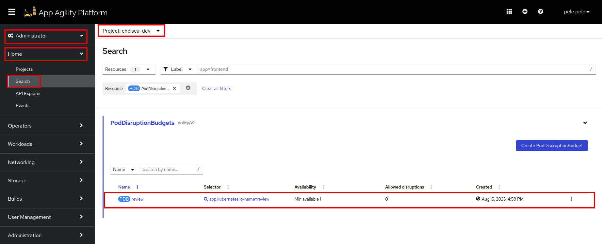

# Using Pod Disruption Budgets (PDB) in SAAP

Pod Disruption Budget (PDB) is a crucial tool for maintaining the availability and stability of your applications in SAAP during updates and disruptions. By setting the minimum and maximum pod availability, you can ensure that your application remains operational even in the face of cluster changes.

In this tutorial, you will learn how to use Pod Disruption Budget (PDB) to manage the availability and stability of your applications in SAAP during updates and maintenance activities. PDB help ensure that a minimum number of pods are available and operational at all times, reducing the risk of service disruptions.

## Objectives

- Configure a Pod Disruption Budget for an application deployed on SAAP.
- Observe the behavior of the PDB by deleting a pod and analyzing the changes in PDB status.

## Key Results

- Successfully enable and monitor a Pod Disruption Budget for the application's deployment on SAAP.

## Tutorial

1. Enable `pdb` in your `deploy/values.yaml` file. Add the following yaml:

    ```yaml
    # Enable Pod Disruption Budget (PDB) for your application's pods.
    pdb:
        # Set PDB enabled to true to activate the Pod Disruption Budget.
      enabled: true
        # Specify the minimum number of available pods during disruptions. In this case, ensure at least 1 pod is available at all times.
      minAvailable: 1
        # Specify the maximum number of pods that can be unavailable simultaneously. During disruptions, allow up to 2 pods to be unavailable.
      maxUnavailable: 2
    ```

    It should look like this:

    

    > Note: The indentation should be **application.pdb**.

1. Save and run `tilt up` at the root of your directory. Hit the space bar and the browser with `TILT` logs will be shown. If everything is green then the changes will be deployed on the cluster.

    Let's see if our `pdb` has deployed.

1. Log in to SAAP. Go to Administrator > Home > Search and search for `pdb`.

    

1. Click on `PodDisruptionBudget` and see the newly created `pdb` named `review`.

    

1. Click on `review` `pdb`. Go to `YAML` and scroll down and see the `status` of `pdb`. Check out the status and `currentHealthy: 1`, `desiredHealthy: 1`.

    

    Let's create a disruption and see if `pdb` works accurately.

1. Delete the `review` pod and check the `pdb status`.

    

1. Go to `pdb review`, and check the `status` now. Click on reload. Now look at the `currentHealthy: 0`, which clearly shows that `pdb` is working fine.

    

    As soon as the pod is deleted, a new pod will be created, and `pdb status` will change to `currentHealthy: 1`. Click on `reload` and you will see the updated status.

Remember that the behavior of the `PDB` and the speed at which it restores pod availability may be influenced by factors such as node resources, cluster conditions, and pod scheduling rules. It's important to give the system some time to react and observe how it gradually restores the desired number of healthy pods according to the `PDB` constraints.

Awesome! Let's move on to the next tutorial to add network policy in your application.
