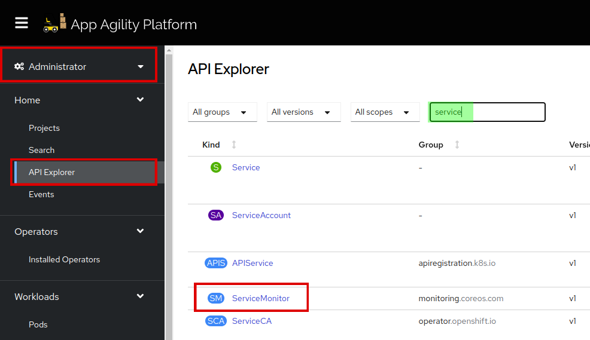
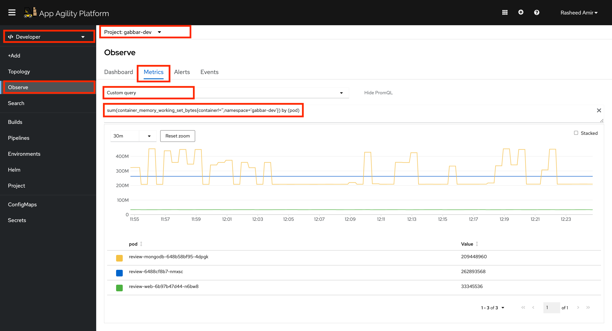

# Add Service Monitor

SAAP gathers the base metrics to see how our pods are doing. In order to get application specific metrics (like response time or number of reviews or active users etc) alongside the base ones, we need another object `ServiceMonitor`. It will let Prometheus know which endpoint the metrics are exposed so that Prometheus can scrape them. And once the Prometheus has the metrics, we can run query on them (just like we did before!) and create shiny dashboards!

## Objectives

- Configure ServiceMonitor objects to gather application-specific metrics, such as response time and number of reviews, alongside the base metrics for better performance analysis.

## Key Results

- Enhance observability by implementing robust monitoring and metrics collection for applications within SAAP.
- Enable developers to analyze and interpret the performance and behavior of their applications through metrics visualization.

## Tutorial

Now, let's add the `ServiceMonitor` for our `stakater-nordmart-review-api` application.

1. Open up `stakater-nordmart-review-api/deploy/values.yaml` file. Add this yaml in your `values.yaml` file.

    ```yaml
    ## Service Monitor
    serviceMonitor:
        enabled: true
        endpoints:
        - interval: 5s
            path: /actuator/prometheus # path where your metrics are exposed
            port: http
    ```

1. Run `tilt up` at the root of your directory. Hit the space bar and the browser with `TILT` logs will be shown. If everything is green then the changes will be deployed on the cluster.

1. To find `serviceMonitor` in SAAP, first login with your credentials, go to `API Explorer`, filter by service, find `ServiceMonitor`:

    

    Click on `ServiceMonitor` and go to `instances`:

    

   You can run queries across the namespace easily with `promql`, a query language for Prometheus. Run a `promql` query to get some info about the memory consumed by the pods in your `<your-namespace>` namespace/project.

1. Go to Developer > Observe > Metrics. Select `Custom query` and paste the below query. Make sure to replace `your-namespace` before running it. Press Enter, and see the metrics for your application specifically.

    ```bash
    sum(container_memory_working_set_bytes{container!='',namespace='<your-namespace'}) by (pod)
    ```

    

Voila, you sucessfully exposed metrics for your application!

Move on to next tutorial to see how to trigger alerts for your application.
