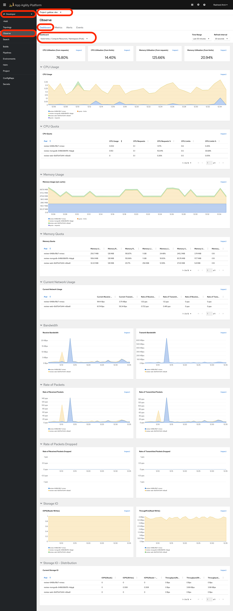

# Monitor your Application

In this tutorial, you will learn how to leverage SAAP's built-in monitoring capabilities to observe and enhance the performance of your applications. SAAP uses powerful tools like Prometheus stack integration and Grafana, allowing you to efficiently query and visualize metrics, as well as troubleshooting and monitoring. Whether it's examining basic health indicators or diving into application-specific metrics, SAAP makes application monitoring seamless and effective. Let's dive in and explore how to supercharge your monitoring efforts with SAAP!

## Objectives

- Enable and utilize SAAP's built-in User Workload Monitoring to observe basic health indicators of applications.

## Key Results

- Enable developers to analyze and interpret the performance and behavior of their applications through efficient monitoring.
- Centralize and streamline the monitoring process to facilitate proactive issue identification and troubleshooting.

## Tutorial

### SAAP Monitoring (pods etc.)

1. User Workload Monitoring is enabled by default in SAAP.

    Go to `SAAP` in `Developer` view, go to `Observe`, it should show basic health indicators under `<your-namespace>` Project

    

Great! let's now see how to expose metric for your application in next tutorial.
