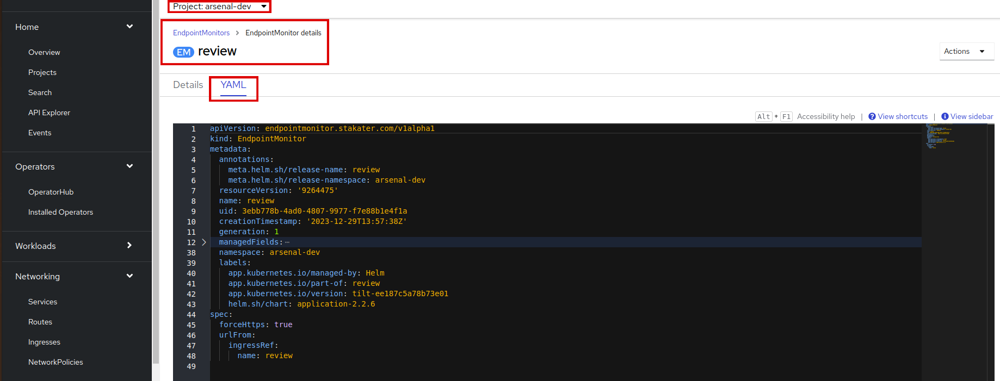

# Add Synthetic Monitoring using UptimeRobot

In this tutorial, we'll guide you through the process of configuring UptimeRobot's Endpoint Monitoring to generate alerts for your application on SAAP based on its availability. Additionally, we'll cover the setup of TLS for secure communication with your application, enhancing data integrity and privacy.

## Objectives

- Enable and configure UptimeRobot's Endpoint Monitoring for your application on SAAP.
- Generate a self-signed TLS certificate and create a TLS secret in SAAP.
- Update the Ingress configuration to include TLS settings for secure communication.

## Key Results

- Successful configuration of UptimeRobot Endpoint Monitoring, implementation of TLS for secure communication for your deployed application.

## Tutorial

### Enable Endpoint Monitoring in values.yaml

1. You need to add the following lines to your `deploy/values.yaml` file:

  ```yaml
    ## Endpoint Monitor
    endpointMonitor:
    enabled: true
  ```

### Create a TLS Certificate

1. Review the `https` setting in our `application` [chart](https://github.com/stakater/application/tree/master) template for Endpoint Monitor, you'll find out that the `https` is true by default. So for that purpose we need to create a `TLS` certificate.

    ```sh
    openssl req -x509 -nodes -days 365 -newkey rsa:2048 -keyout tls.key -out tls.crt -subj "/CN=review.<CLUSTER_NAME>.lab.kubeapp.cloud"
    ```

    > Note: Add your cluster name in the above route.

    Now we have our `TLS` certificate and `TLS` key. Save it to a path.

### Create a TLS Secret

1. Let's create `TLS` secret on your cluster. Identify the namespace you are using to deploy the application.

    ```sh
    oc create secret tls review-tls-secret -n <YOUR_NAMESPACE> --cert=/path/to/your/tls.crt --key=/path/to/your/tls.key
    ```

### Update Ingress Configuration in values.yaml

1. By default, Endpoint Monitor uses `ingress`. As we already have created `TLS` secret, let's modify it by adding the `TLS` secret to our ingress configuration.

    ```yaml
    # Ingress
    ingress:
    enabled: true
    ingressClassName: openshift-default
    servicePort: http
    hosts:
        - host: review.<CLUSTER_NAME>.kubeapp.cloud
        paths:
        - path: /
            servicePort: 'http'
    tls:
        - secretName: review-tls-secret # TLS Secret name that we created above
        hosts:
            - review.<CLUSTER_NAME>.kubeapp.cloud
    ```

1. Save and run `tilt up` at the root of your directory. Hit the space bar and the browser with `TILT` logs will be shown. If everything is green then the changes will be deployed on the cluster.

1. Navigate to SAAP to see our configurations. Let's first check ingress, go to your namespace and then switch to Networking > Ingresses.

    

    Verify that the Ingress is created with the name `review`.

1. Next, check the Routes. As `TLS` is in use, the route should now have  `https` now. In your namespace, go to Networking > Routes.

    

    Confirm that the route has been updated to use `https`.

1. Let's verify our Endpoint Monitor, it should be created by now. Go to Home > Search > Resources, type Endpoint Monitor. If your are in your namespace, you'll see an Endpoint Monitor created there.

    

    We have an `Endpoint Monitor` with the name `review`. Awesome!

    You can also view it's yaml, click on the name and go to `yaml`:

    

Great job! You've successfully configured UptimeRobot Endpoint Monitoring to generate alerts for your SAAP application based on its availability. Now, whenever your application experiences downtime, an alert will be triggered on your UptimeRobot alert contact.
