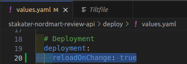
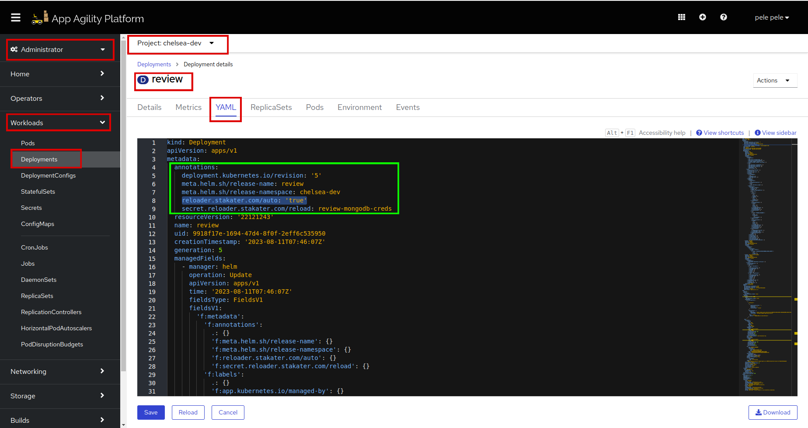
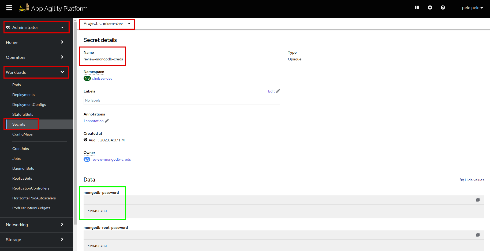
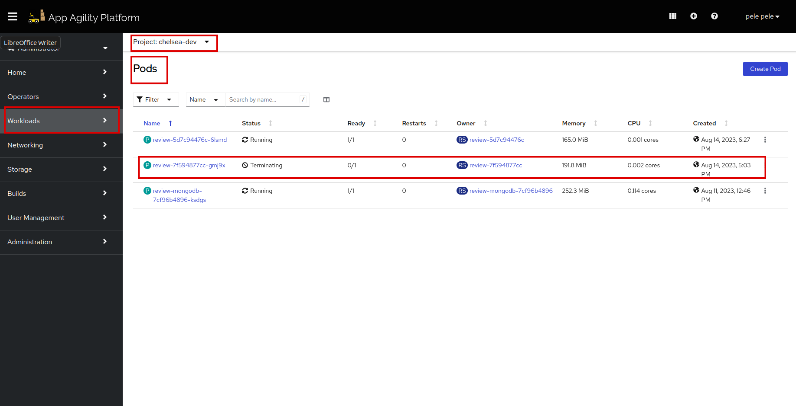

# Validate Auto Reload of your Application

Managing application deployments and keeping configurations up-to-date can be challenging. Changes to secrets or configmaps for instance, often require manual intervention to update the application and trigger a redeployment. This can lead to operational inefficiencies and potential downtime.

To address this challenge, Stakater has Reloader—a powerful tool that automates the process of reloading deployments when related resources, such as secrets or configmaps, change. In this tutorial, we will explore how to set up Reloader in your SAAP and configure it to automatically trigger the reload of a deployment whenever a secret changes.

## Objectives

- Enable Reloader to monitor changes in the secret and reload the deployment.
- Verify the changes in the secret triggers an automatic reload of the deployment.

## Key Results

- Test the automatic deployment reloading by updating the secret and observing the changes.

## Tutorial

Let's take a look at the secret before any change.

The secret we created for our deployment earlier, notice the details and the value of `mongodb-password` which is `123456789`.


1. Add this yaml to your `deploy/values.yaml` file.

    ```yaml
    ## Enable reloader on changes
    reloadOnChange: true
    ```

    It should look like this:

    

    > Note: The indentation should be **application.deployment.reloadOnChange: true**.

1. Save and run `tilt up` at the root of your directory. Hit the space bar and the browser with `TILT` logs will be shown. If everything is green then the changes will be deployed on the cluster.

1. Now go to the `Deployments`, and see if it has updated with the `Reloader` annotation:

    

    Let's change one of the values of `review-mongodb-creds` secret.

1. Log in to `Vault` and got to `your-tenant/kv`, click on the secret `review-mongodb-creds`, then click on `create new version`.

    

1. You can now edit the values of your secret which will be considered a new version of your external secret. Edit `mongodb-password` and set the value to `123456780`. Hit `Save`.

    

1. Let's go to SAAP to see if the new version of the external secret has been deployed. Go to `review-mongodb-creds`, and scroll down to see `Data`. On the right corner you will see `Reveal values`, hit on it and see the value for `mongodb-password`.

    

1. Now let's go to `Pods` and see if the pod of our `review` application has reloaded. You will see the new pod `review` is deploying and once it's in a `Running` state and `Ready 1/1`, the older pod will be `terminated`.

    
    .

To see more information related to Stakater's Reloader project, click [here](https://github.com/stakater/Reloader).

And voila! now you don't have to redeploy your application manually for each change, Reloader to the Rescue!

Let's move on to the next tutorial to know how to set up alerts for any downtime.
