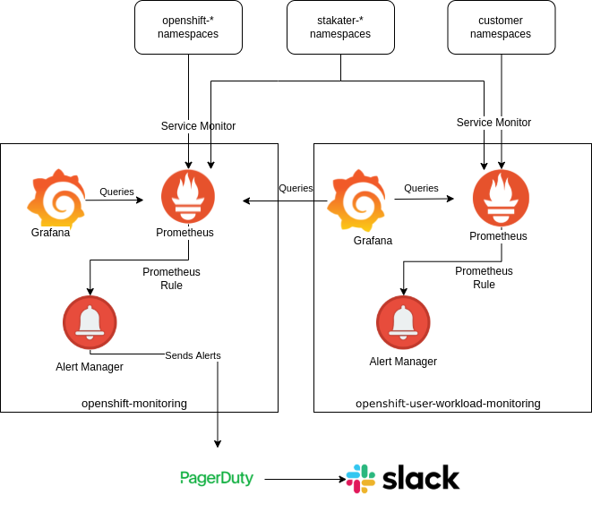

# Creating Application Alerts

## Overview

There are 2 types of monitoring:

1. Infrastructure monitoring (comes default with OpenShift installation)
2. Workload monitoring (comes default with OpenShift installation)



## Infrastructure Monitoring

1. Prometheus
2. Grafana
3. Alertmanager

## Workload Monitoring

1. Prometheus
2. Grafana
3. Alertmanager

## Creating Application Alerts to Monitor Application workloads

In order to define Prometheus rules to monitor applications on the basis of exposed metrics. You need 3 things:

1. Metrics Exposed by Application endpoints
2. Metrics endpoints are scraped via ServiceMonitor by Prometheus
3. Defining PrometheusRule CustomResource

### Metrics Exposed by the Application

Prometheus metrics can be exposed on any endpoint from the application (usually `/metrics`)

### Metrics endpoints are scraped via ServiceMonitor by Prometheus

The Prometheus Operator includes a Custom Resource Definition that allows the definition of the ServiceMonitor. The ServiceMonitor is used to define an application you wish to scrape metrics from, the controller will action the ServiceMonitors we define and automatically build the required Prometheus configuration.

Example ServiceMonitor:

```yaml
apiVersion: monitoring.coreos.com/v1
kind: ServiceMonitor
metadata:
  name: example-svc-monitor
  namespace: example-namespace
spec:
  endpoints:
  - interval: 30s
    path: /metrics
    port: metrics
  selector:
    matchLabels:
      app: example-svc-label
```