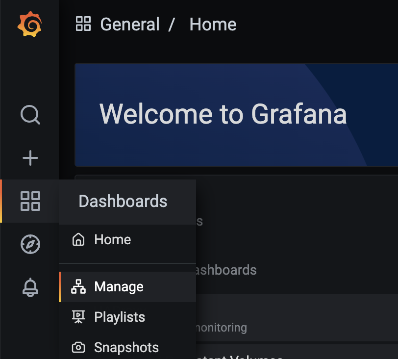
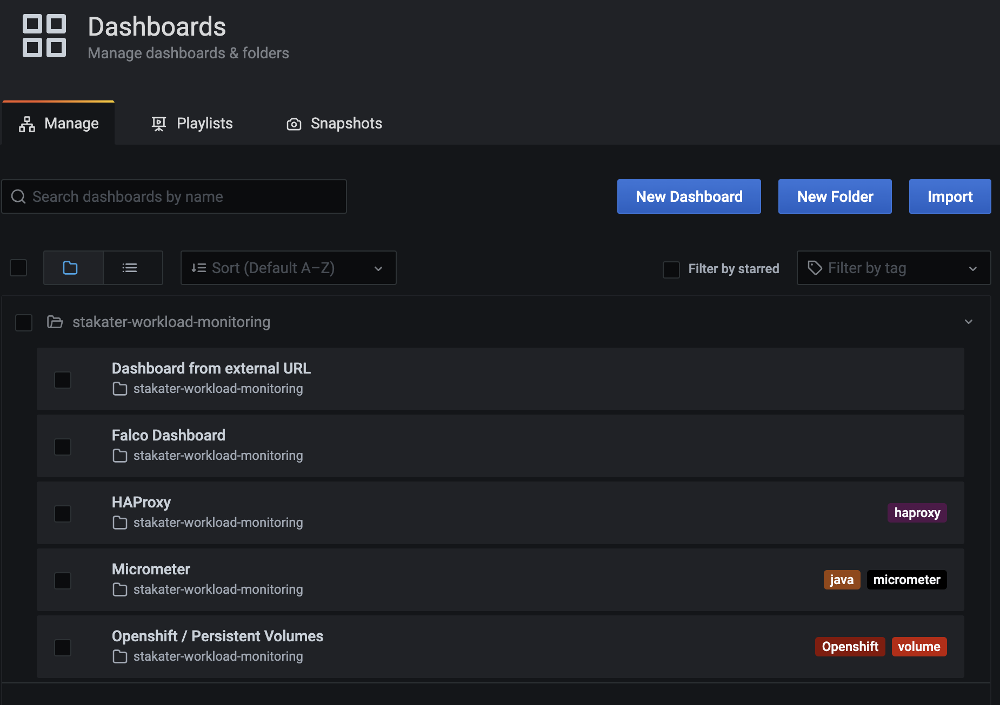

# Create Grafana Dashboard Guide

This document explains how to create Grafana Dashboard via GrafanaDashboard CR powered by Grafana operator. In this way there is no need to configure/import it via web UI. Now, developers can ship new dashboards in any namespace and deploy them via GitOps. If Dashboard definition/JSON is invalid, the dashboard will not appear in Grafana web UI.

## Prerequisite

- Grafana should be up and running. You should be able to find it under Workload Monitoring category in your Forecastle link.

## Instructions

1. Create GrafanaDashboard definition

   You can choose any existing namespace. The label `grafanaDashboard: grafana-operator` is required for Grafana Operator to discover the dashboard. The JSON string with the dashboard contents is placed in the `json` section. Check the [official documentation](https://grafana.com/docs/reference/dashboard/#dashboard-json) for details on JSON Model. You can create a dashboard via web UI first, and then export the dashboard JSON to define a GrafanaDashboard CR (Custom Resource). If the JSON is invalid, the dashboard will not appear in Grafana web UI. Below is a sample GrafanaDashboard CR yaml.

    ```yaml
    apiVersion: integreatly.org/v1alpha1
    kind: GrafanaDashboard
    metadata:
      name: grafana-dashboard-example
      namespace: test-ns
      labels:
        grafanaDashboard: grafana-operator
    spec:
      json: |-
        {
          "annotations": {
            "list": [
              {
                "builtIn": 1,
                "datasource": "-- Grafana --",
                "enable": true,
                "hide": true,
                "iconColor": "rgba(0, 211, 255, 1)",
                "name": "Annotations & Alerts",
                "type": "dashboard"
              }
            ]
          },
          "editable": true,
          "gnetId": null,
          "graphTooltip": 0,
          "id": null,
          "links": [],
          "panels": [
            {
              "aliasColors": {},
              "bars": false,
              "dashLength": 10,
              "dashes": false,
              "datasource": null,
              "fieldConfig": {
                "defaults": {},
                "overrides": []
              },
              "fill": 1,
              "fillGradient": 0,
              "gridPos": {
                "h": 9,
                "w": 12,
                "x": 0,
                "y": 0
              },
              "hiddenSeries": false,
              "id": 2,
              "legend": {
                "avg": false,
                "current": false,
                "max": false,
                "min": false,
                "show": true,
                "total": false,
                "values": false
              },
              "lines": true,
              "linewidth": 1,
              "nullPointMode": "null",
              "options": {
                "alertThreshold": true
              },
              "percentage": false,
              "pluginVersion": "7.5.11",
              "pointradius": 2,
              "points": false,
              "renderer": "flot",
              "seriesOverrides": [],
              "spaceLength": 10,
              "stack": false,
              "steppedLine": false,
              "thresholds": [],
              "timeFrom": null,
              "timeRegions": [],
              "timeShift": null,
              "title": "Panel Title",
              "tooltip": {
                "shared": true,
                "sort": 0,
                "value_type": "individual"
              },
              "type": "graph",
              "xaxis": {
                "buckets": null,
                "mode": "time",
                "name": null,
                "show": true,
                "values": []
              },
              "yaxes": [
                {
                  "format": "short",
                  "label": null,
                  "logBase": 1,
                  "max": null,
                  "min": null,
                  "show": true
                },
                {
                  "format": "short",
                  "label": null,
                  "logBase": 1,
                  "max": null,
                  "min": null,
                  "show": true
                }
              ],
              "yaxis": {
                "align": false,
                "alignLevel": null
              }
            }
          ],
          "schemaVersion": 27,
          "style": "dark",
          "tags": [],
          "templating": {
            "list": []
          },
          "time": {
            "from": "now-6h",
            "to": "now"
          },
          "timepicker": {},
          "timezone": "",
          "title": "New dashboard",
          "uid": null,
          "version": 0
        }
    ```

1. Apply GrafanaDashbaord CR to your cluster, manually or via GitOps way

1. View the dashboard via Grafana web UI

   1. Under `stakater-workload-monitoring` project, find the URL to Grafana through Cluster menu [Networking]->[Routes]
   1. Open Grafana web UI, and go to [Dashboards]->[Manage] to view Dashboards management page
      

   1. Your dashboard will be put in a folder named after the namespace that you specified in GrafanaDashboard definition. The following is an example. 

## Application chart

A template for installing GrafanaDashboard is provided by [application chart](https://github.com/stakater-charts/application). You are able to specify configuration via `values.yaml` and install dashboards on cluster. The following is an example.

```yaml
grafanaDashboard:
  enabled: true
  additionalLabels:
    test-label: chart
  annotations: 
    test-annoation: chart
  contents:
    dashboard-test-name-1: 
      json: |-
        {
          ...
        }
```
